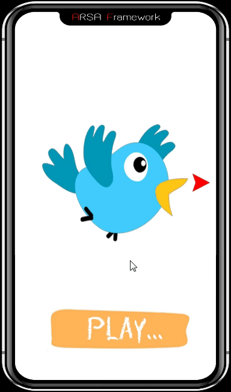

AnimateBuiltin
Result:

Source code:

{
	set($state, 0)
}function(init)

{
	touch( "press", touch("isleft", builtin($namein, "movein=0x2500x1")) )
	touch( "press", touch("isleft", builtin($nameout, "moveout=0x2500x0")) )
	touch( "press", touch("isleft", proc(set($state, $state_change) >> touchclear()) ) )
}function(update_isleft, $nameout, $namein, $state_change)

{
	touch( "press", touch("isright", builtin($namein, "movein=0x2500x0")) )
	touch( "press", touch("isright", builtin($nameout, "moveout=0x2500x1")) )
	touch( "press", touch("isright", proc(set($state, $state_change) >> touchclear()) ) )
}function(update_isright, $nameout, $namein, $state_change)

{
	builtin($layername, "r=0x0x10x50x0x1")
	setrotflags($layername, "b")
}function(rotate_buttom, $layername)

{
	builtin($layername, "r=0x0x10x30x0x1")
	setrotflags($layername, "t")
}function(rotate_top, $layername)

{
	builtin($layername, "scale=0.8x1x1x0x1")
}function(scale, $layername)

{
	if($state== 0) function(rotate_top, "bird")
	if($state== 1) function(rotate_buttom, "ant")
	if($state== 2) function(scale, "squid")
	touchclear()
}function(touch_play)

touch("release", "play", function(touch_play) )
if($state== 0) function(update_isleft, "bird","ant", 1)
if($state== 1) function(update_isleft, "ant","squid", 2)
if($state== 2) function(update_isright, "squid","ant", 1)
if($state== 1) function(update_isright, "ant","bird", 0)

ifelse($state== 0, visible(false,"moveleft"), visible(true,"moveleft"))
ifelse($state== 2, visible(false,"moveright"), visible(true,"moveright"))