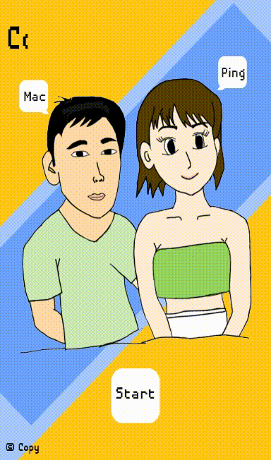

AnimateControl_Advanced
Result:




Source code:
```

{
	screensize(640,960)
	int($maxb, 8)
	int($button_toggle[$maxb], 0)
	int($brown_count, 0)
	int($boob_count, 0)
}function(init)

{
	if($button_toggle[$id]==0) setcolor($name, 255,255,255,255)
	if($button_toggle[$id]==1) setcolor($name, 28,124,255,255)

	if(touch("release",$name)!=true) return(-1)

	// toggle
	ifelse($button_toggle[$id]==0,set($button_toggle[$id], 1), set($button_toggle[$id], 0) )
	touchclear()
	//alog($button_toggle[$id])
	return($button_toggle[$id])
}function(button_toggle, $name, $id)

if(touch("release","button0")==true) builtin("right_eye_brown", "move=0x-10x100x1x1")
if(touch("release","button1")==true) builtin("left_eye_brown", "move=0x-10x100x1x1")

set($by,getposy("right_eye_brown"))
if($by<260) posy("right_eye_brown", 260)
set($by,getposy("left_eye_brown"))
if($by<260) posy("left_eye_brown", 260)

// boy mount
set($ret, function(button_toggle, "button2", 3))
if($ret==1) builtin("mount", "scale=1x1.5x5x1x0")
if($ret==0) builtin("mount", "scale=1.5x1x5x1x0")

// girl right eye wing
set($ret, function(button_toggle, "button4", 4))
if($ret==1) builtin("right_eye_open", "visible=1x100x0x800x1")
if($ret==0) builtin("right_eye_open", "visible=1x0x100x800x1")

set($ret, function(button_toggle, "button5", 5))
if($ret==1) builtin("left_eye_open", "visible=1x100x0x800x1")
if($ret==0) builtin("left_eye_open", "visible=1x0x100x800x1")

set($ret, function(button_toggle, "button6", 6))
if($ret==1) proc( builtin("boob", "scale=1x1.1x0.5x1x0") >> add($boob_count, 1) )
if($ret==0) proc( builtin("boob", "scale=1.1x1x0.5x1x0") >> add($boob_count, 1) )

{
	anim("left_eye_brown", "reset" )
	anim("right_eye_brown", "reset" )
	anim("mount", "reset" )
	add($brown_count, 1)
}function(reset_boy)
if(touch("release","button3")==true) function(reset_boy)

{
	anim("left_eye_open", "reset" )
	anim("right_eye_open", "reset" )
	anim("boob", "reset" )
	add($boob_count, 1)
}function(reset_girl)
if(touch("release","button7")==true) function(reset_girl)

{
	for($i=0;$i<$maxb;++$i) set($button_toggle[$i], 0)

	anim("left_eye_brown", "clearall" )
	anim("right_eye_brown", "clearall" )
	anim("mount", "clearall" )
	anim("left_eye_open", "clearall" )
	anim("right_eye_open", "clearall" )
	anim("boob", "clearall" )

	scale("boob", 1, 1)
	scale("mount", 1, 1)
	posy("left_eye_brown", getoriy("left_eye_brown"))
	posy("right_eye_brown", getoriy("right_eye_brown"))
	setvisiblepercent("left_eye_open", 100, 100)
	setvisiblepercent("right_eye_open", 100, 100)
	set($brown_count, 0)
	set($boob_count, 0)
}function(resetall)
if(touch("release","reset")==true) function(resetall)

if(touch("release","share")==true) sharescreenshot("", "Couple Face App!", "Shared a screen shot.")

if(touch("release","home")==true) psd("AnimateControl_Advanced_start.psd")

ifelse($brown_count>=10,visible(true,"water"),visible(false,"water") )
ifelse($boob_count>=10,visible(true,"angry"),visible(false,"angry") )

```